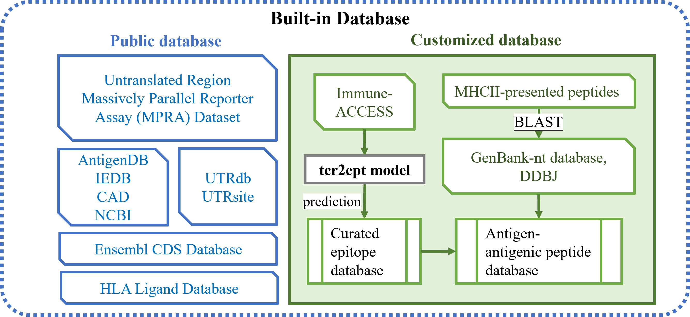
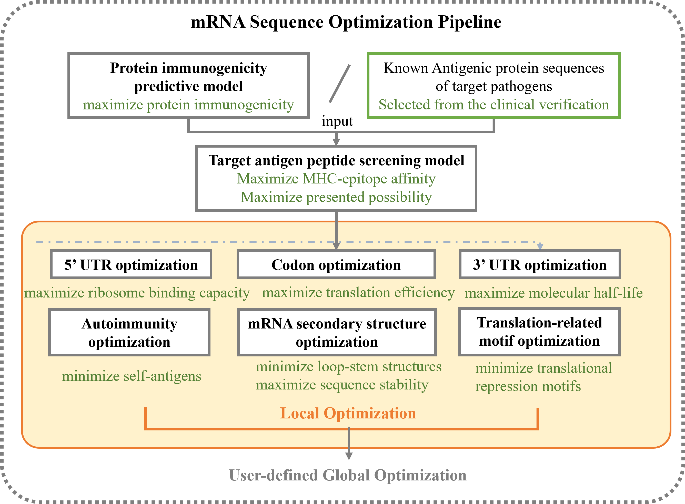
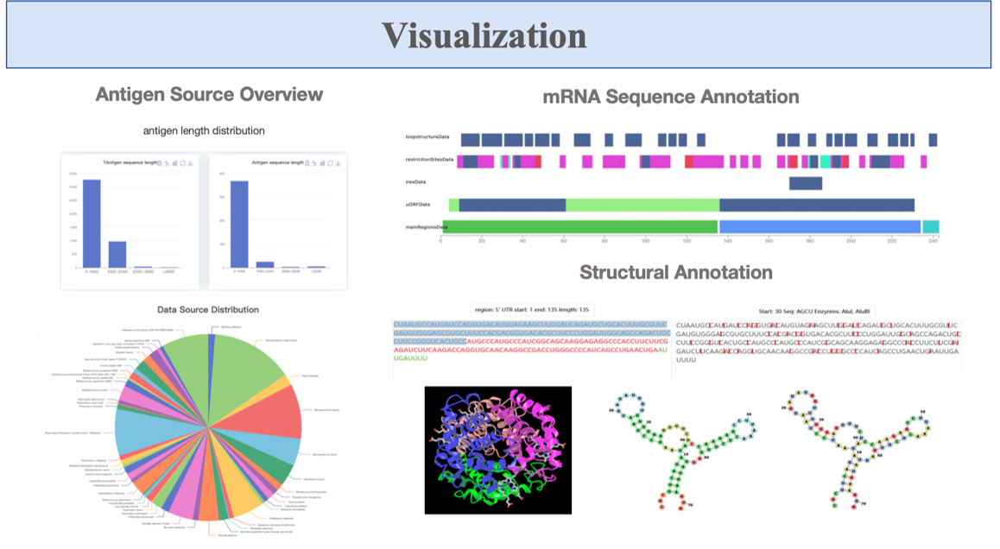

# Welcome to mRNA Vaccine Design Platform

mRNA Vaccine Design Platform is an advanced online platform dedicated to the intelligent design of therapeutic mRNA vaccines. Our platform integrates state-of-the-art tools computational biology tools and machine learning models to provide a seamless experience for vaccine developers.

### Database

The platform features a robust database for antigen and UTR information, organized for intuitive access and analysis. Users can explore various datasets efficiently, gaining insights into mRNA-related characteristics and their applications in vaccine development.

### Analysis 

We also provide mRNA sequence optimazation pipeline for users to design their mRNA vaccines. Users can upload protein or mRNA sequences in fasta format and run the design steps. The complete workflow includes target antigen peptide screening, 5’UTR optimazation, CDS design, 3’UTR optimazation. The design platform performs automatic analysis and returns results that can be visualized and downloaded.

### Visualization 

Additionally, mRNA Vaccine Design Platform supports interactive visualization of the antigen database and customized analysis results. Specifically, the platform generates antigen sequence length distribution charts, antigen source organism distribution charts, mRNA sequence annotation’s visualization and mRNA structural visualization. All visualizations can be downloaded in high-quality publication-ready format.

